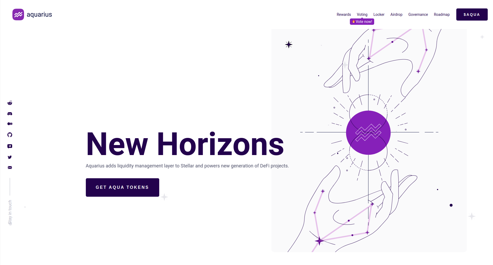

<!--
*** Thanks for checking out the Best-README-Template. If you have a suggestion
*** that would make this better, please fork the repo and create a pull request
*** or simply open an issue with the tag "enhancement".
*** Don't forget to give the project a star!
*** Thanks again! Now go create something AMAZING! :D
-->

<!-- PROJECT SHIELDS -->
[![Contributors][contributors-shield]][contributors-url]
[![Forks][forks-shield]][forks-url]
[![Stargazers][stars-shield]][stars-url]
[![Issues][issues-shield]][issues-url]

<!-- PROJECT LOGO -->
 

  

<h3 align="center">Aquarius</h3>

  

    Aquarius adds liquidity management layer to Stellar and powers new generation of DeFi projects.
     
     
    <a href="https://github.com/AquaToken/aqua-network-website/issues">Report Bug</a>
    ·
    <a href="https://gov.aqua.network/">Request Feature</a>
  

<!-- TABLE OF CONTENTS -->

  
Table of Contents

  <ol>
    <li>
      <a href="#about-the-project">About The Project</a>
      <ul>
        <li><a href="#built-with">Built With</a></li>
      </ul>
    </li>
    <li>
      <a href="#getting-started">Getting Started</a>
      <ul>
        <li><a href="#prerequisites">Prerequisites</a></li>
        <li><a href="#installation">Installation</a></li>
      </ul>
    </li>
    <li><a href="#roadmap">Roadmap</a></li>
    <li><a href="#contributing">Contributing</a></li>
    <li><a href="#contact">Contact</a></li>
  </ol>

<!-- ABOUT THE PROJECT -->
## About The Project

Aquarius is designed to supercharge trading on Stellar, bring more liquidity and give control over how it is distributed across various market pairs. It adds incentives for SDEX traders ("market maker rewards") and rewards for AMM liquidity providers. Aquarius allows community to set rewards for selected markets through on-chain voting.

(<a href="#top">back to top</a>)

### Built With

* [Gulp](https://www.npmjs.com/package/gulp)
* [Sass](https://sass-lang.com/)

(<a href="#top">back to top</a>)

<!-- GETTING STARTED -->
## Getting started
Run `npm install` to install all dependencies

## Development server

Run `npm run start` for a dev server. Page will opens automatically in browser

## Build

Run `npm run build` to build the project. The build artifacts will be stored in the `dist/` directory.

(<a href="#top">back to top</a>)

<!-- ROADMAP -->
## Roadmap

- [x] Idea and discussion
- [x] Start of development
- [x] Aquarius v0.1: MVP
- [x] Aquarius v0.2: Voting
- [ ] Aquarius v1.0: DAO

See the [open issues](https://github.com/AquaToken/aqua-network-website/issues) for a full list of proposed features (and known issues).

(<a href="#top">back to top</a>)

<!-- CONTRIBUTING -->
## Contributing

Contributions are what make the open source community such an amazing place to learn, inspire, and create. Any contributions you make are **greatly appreciated**.

If you have a suggestion that would make this better, please fork the repo and create a pull request. You can also simply open an issue with the tag "enhancement".
Don't forget to give the project a star! Thanks again!

1. Fork the Project
2. Create your Feature Branch (`git checkout -b feature/AmazingFeature`)
3. Commit your Changes (`git commit -m 'Add some AmazingFeature'`)
4. Push to the Branch (`git push origin feature/AmazingFeature`)
5. Open a Pull Request

(<a href="#top">back to top</a>)

<!-- CONTACT -->
## Contact

Email: [hello@aqua.network](mailto:hello@aqua.network)
Telegram chat: [@aquarius_HOME](https://t.me/aquarius_HOME)
Telegram news: [@aqua_token](https://t.me/aqua_token)
Twitter: [@aqua_token](https://twitter.com/aqua_token)
GitHub: [@AquaToken](https://github.com/AquaToken)
Discord: [@Aquarius](https://discord.gg/sgzFscHp4C)
Reddit: [@AquariusAqua](https://www.reddit.com/r/AquariusAqua/)
Medium: [@aquarius-aqua](https://medium.com/aquarius-aqua)

Project Link: [https://github.com/AquaToken/aqua-network-website](https://github.com/AquaToken/aqua-network-website)

(<a href="#top">back to top</a>)

<!-- MARKDOWN LINKS & IMAGES -->
<!-- https://www.markdownguide.org/basic-syntax/#reference-style-links -->
[contributors-shield]: https://img.shields.io/github/contributors/AquaToken/aqua-network-website.svg?style=for-the-badge
[contributors-url]: https://github.com/AquaToken/aqua-network-website/graphs/contributors
[forks-shield]: https://img.shields.io/github/forks/AquaToken/aqua-network-website.svg?style=for-the-badge
[forks-url]: https://github.com/AquaToken/aqua-network-website/network/members
[stars-shield]: https://img.shields.io/github/stars/AquaToken/aqua-network-website.svg?style=for-the-badge
[stars-url]: https://github.com/AquaToken/aqua-network-website/stargazers
[issues-shield]: https://img.shields.io/github/issues/AquaToken/aqua-network-website.svg?style=for-the-badge
[issues-url]: https://github.com/AquaToken/aqua-network-website/issues
[product-screenshot]: images/screenshot.png
